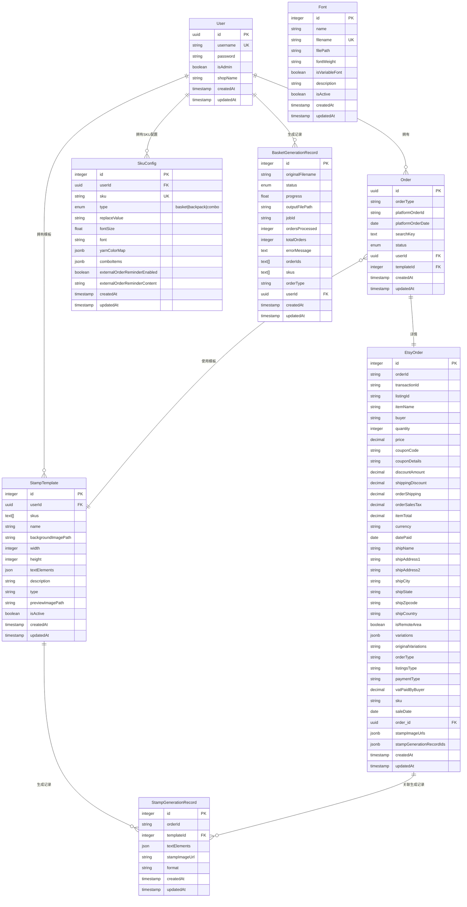
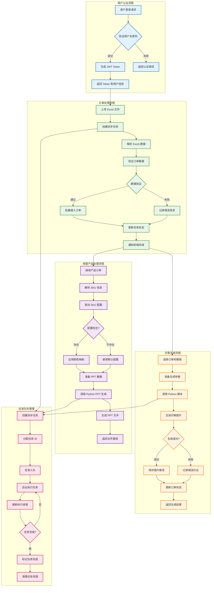
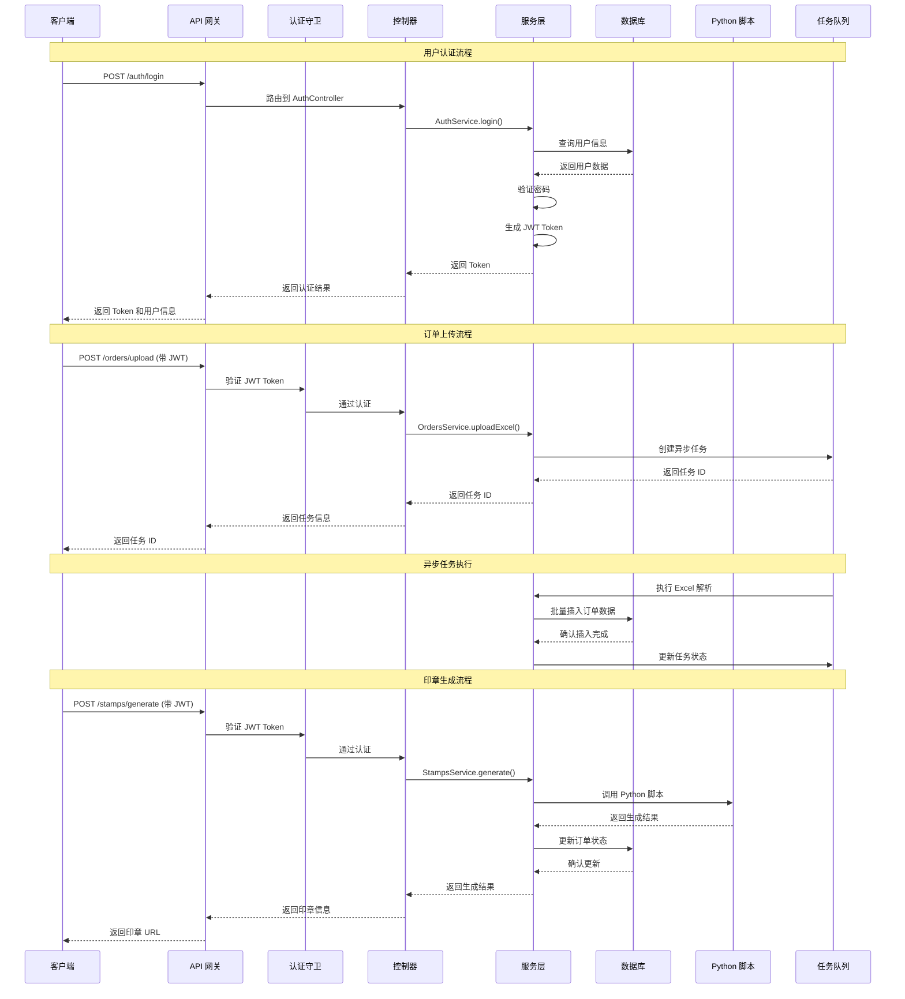
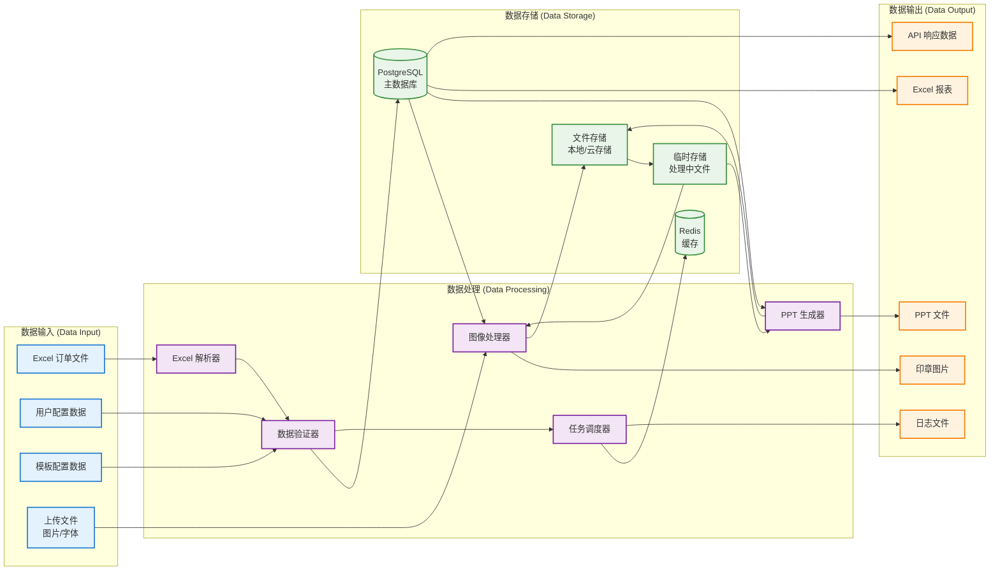

# Etsy Helper Server 架构图表

本文档包含 Etsy Helper Server 后端项目的架构图表和业务流程图，使用 Mermaid 语法绘制。

## 1. 后端模块架构图

展示了 NestJS 后端的模块结构、服务依赖关系以及外部集成。

```mermaid
graph TB
    %% 客户端层
    subgraph "客户端层 (Client Layer)"
        WebApp[前端 Web 应用]
        MobileApp[移动端应用]
        ThirdParty[第三方集成]
    end

    %% API 网关层
    subgraph "API 网关层 (API Gateway)"
        NestJSApp[NestJS 应用]
        AuthGuard[JWT 认证守卫]
        ValidationPipe[数据验证管道]
        LoggingInterceptor[日志拦截器]
    end

    %% 控制器层
    subgraph "控制器层 (Controllers)"
        AuthController[AuthController<br/>认证控制器]
        UsersController[UsersController<br/>用户管理]
        OrdersController[OrdersController<br/>订单管理]
        StampsController[StampsController<br/>印章系统]
        BasketController[BasketController<br/>母婴产品]
        FontsController[FontsController<br/>字体管理]
    end

    %% 服务层
    subgraph "服务层 (Services)"
        AuthService[AuthService<br/>认证服务]
        UsersService[UsersService<br/>用户服务]
        OrdersService[OrdersService<br/>订单服务]
        StampsService[StampsService<br/>印章服务]
        BasketService[BasketService<br/>母婴服务]
        FontsService[FontsService<br/>字体服务]

        subgraph "专用服务 (Specialized Services)"
            PythonStampService[PythonStampService<br/>Python 印章生成]
            JobQueueService[JobQueueService<br/>任务队列服务]
            ExcelParserService[ExcelParserService<br/>Excel 解析服务]
            FileUploadService[FileUploadService<br/>文件上传服务]
        end
    end

    %% 数据访问层
    subgraph "数据访问层 (Data Access)"
        subgraph "TypeORM 实体 (Entities)"
            UserEntity[User Entity<br/>用户实体]
            OrderEntity[Order Entity<br/>订单实体]
            EtsyOrderEntity[EtsyOrder Entity<br/>Etsy订单实体]
            StampTemplateEntity[StampTemplate Entity<br/>印章模板实体]
            SkuConfigEntity[SkuConfig Entity<br/>SKU配置实体]
        end

        TypeORMModule[TypeORM 模块<br/>数据库连接管理]
    end

    %% 外部服务层
    subgraph "外部服务层 (External Services)"
        PostgreSQL[(PostgreSQL<br/>主数据库)]
        Redis[(Redis<br/>缓存数据库)]
        FileSystem[文件系统<br/>上传文件存储]
        PythonScripts[Python 脚本<br/>图像/文档生成]
    end

    %% 连接关系
    WebApp --> NestJSApp
    MobileApp --> NestJSApp
    ThirdParty --> NestJSApp

    NestJSApp --> AuthGuard
    NestJSApp --> ValidationPipe
    NestJSApp --> LoggingInterceptor

    AuthGuard --> AuthController
    ValidationPipe --> UsersController
    ValidationPipe --> OrdersController
    ValidationPipe --> StampsController
    ValidationPipe --> BasketController
    ValidationPipe --> FontsController

    AuthController --> AuthService
    UsersController --> UsersService
    OrdersController --> OrdersService
    StampsController --> StampsService
    BasketController --> BasketService
    FontsController --> FontsService

    OrdersService --> JobQueueService
    OrdersService --> ExcelParserService
    StampsService --> PythonStampService
    StampsService --> FileUploadService
    BasketService --> PythonStampService

    AuthService --> UserEntity
    UsersService --> UserEntity
    OrdersService --> OrderEntity
    OrdersService --> EtsyOrderEntity
    StampsService --> StampTemplateEntity
    BasketService --> SkuConfigEntity

    UserEntity --> TypeORMModule
    OrderEntity --> TypeORMModule
    EtsyOrderEntity --> TypeORMModule
    StampTemplateEntity --> TypeORMModule
    SkuConfigEntity --> TypeORMModule

    TypeORMModule --> PostgreSQL
    JobQueueService --> Redis
    FileUploadService --> FileSystem
    PythonStampService --> PythonScripts

    %% 样式定义
    classDef clientLayer fill:#e3f2fd,stroke:#1976d2,stroke-width:2px
    classDef apiLayer fill:#f3e5f5,stroke:#7b1fa2,stroke-width:2px
    classDef controllerLayer fill:#e8f5e8,stroke:#388e3c,stroke-width:2px
    classDef serviceLayer fill:#fff3e0,stroke:#f57c00,stroke-width:2px
    classDef dataLayer fill:#fce4ec,stroke:#c2185b,stroke-width:2px
    classDef externalLayer fill:#f5f5f5,stroke:#616161,stroke-width:2px

    class WebApp,MobileApp,ThirdParty clientLayer
    class NestJSApp,AuthGuard,ValidationPipe,LoggingInterceptor apiLayer
    class AuthController,UsersController,OrdersController,StampsController,BasketController,FontsController controllerLayer
    class AuthService,UsersService,OrdersService,StampsService,BasketService,FontsService,PythonStampService,JobQueueService,ExcelParserService,FileUploadService serviceLayer
    class UserEntity,OrderEntity,EtsyOrderEntity,StampTemplateEntity,SkuConfigEntity,TypeORMModule dataLayer
    class PostgreSQL,Redis,FileSystem,PythonScripts externalLayer
```

### 架构说明

**客户端层 (Client Layer)**

- 支持多种客户端接入：Web 应用、移动端、第三方集成
- 统一通过 RESTful API 进行通信

**API 网关层 (API Gateway)**

- NestJS 应用作为 API 网关
- JWT 认证守卫处理身份验证
- 数据验证管道确保输入数据合法性
- 日志拦截器记录请求响应信息

**控制器层 (Controllers)**

- 按功能模块划分控制器y
- 处理 HTTP 请求路由和参数验证
- 调用相应的服务层处理业务逻辑

**服务层 (Services)**

- 核心业务逻辑实现
- 专用服务处理复杂功能（Python 集成、任务队列等）
- 服务间协作完成复杂业务流程

**数据访问层 (Data Access)**

- TypeORM 实体映射数据库表结构
- 统一的数据库连接和事务管理
- 支持数据库迁移和版本控制

## 2. 数据库实体关系图

展示了系统中核心实体的关系和数据流。

### 实体关系说明

**用户系统**

- User 是系统的核心实体，支持多租户隔离
- 每个用户可以有多个订单，支持店铺名称关联

**订单系统**

- Order 是订单的基础信息，包含状态和类型
- EtsyOrder 存储详细的 Etsy 订单信息，一对一关联
- 订单可以关联印章模板进行生成

**印章系统**

- StampTemplate 支持多 SKU 配置
- 模板包含复杂的文本元素和图标配置
- 支持多种印章类型和自定义扩展

**配置系统**

- SkuConfig 管理产品 SKU 的配置信息
- 支持毛线颜色映射和字体配置
- Font 管理系统字体资源

### 各表业务作用

**User (`users`)**

- 系统账号主体，承载登录身份、管理员权限和店铺归属信息。
- 作为数据隔离边界，决定用户可访问的订单、模板和生成记录范围。

**Order (`orders`)**

- 订单主表，记录系统内统一订单状态流转（待生成/待审核/已审核等）。
- 负责关联“谁的订单（userId）”与“用哪个模板（stampTemplateId）”。

**EtsyOrder (`etsy_orders`)**

- Etsy 原始订单详情表，保存买家、地址、SKU、变体、价格等业务原始字段。
- 与 `orders` 一对一，用于“平台原始数据”与“系统处理状态”分层。

**StampTemplate (`stamp_templates`)**

- 印章/摇铃模板定义表，保存模板尺寸、文本元素布局、图标配置和适配 SKU。
- 是批量生成印章时的规则来源，支持多类型模板（rubber/steel/rattle 等）。

**StampGenerationRecord (`stamp_generation_records`)**

- 印章生成审计表，记录每次生成时使用的模板、文本参数快照和输出图片地址。
- 用于追溯“某订单某次生成结果”，支持重生成、问题排查和历史回看。

**SkuConfig (`sku_configs`)**

- 母婴/篮子业务的 SKU 配置表，维护颜色映射、字体配置、外部订单提醒等规则。
- 作为订单解析和导出时的字典规则来源，减少人工映射成本。

**Font (`fonts`)**

- 字体资产表，记录字体文件元数据与可用状态。
- 为模板编辑器和 Python 生成服务提供可用字体清单与文件路径映射。

**BasketGenerationRecord (`basket_generation_records`)**

- 篮子/PPT 生成任务记录表，保存任务状态、输入数据快照、输出路径和错误信息。
- 用于异步任务进度展示、失败重试和生成历史管理。

## 3. 业务流程图

展示了系统的核心业务流程和数据处理逻辑。

## 4. API 请求流程图

展示了典型 API 请求的处理流程。

## 5. 数据流图

展示了系统中数据的流转和处理过程。

## 使用说明

这些图表可以在支持 Mermaid 的环境中渲染，包括：

- GitHub/GitLab 的 Markdown 文件
- VS Code 的 Mermaid 插件
- 在线 Mermaid 编辑器
- 文档生成工具 (如 GitBook, Docusaurus)

### 图表说明

1. **后端模块架构图**: 展示了 NestJS 应用的完整架构，从客户端请求到数据存储的各个层次
2. **数据库实体关系图**: 使用 ER 图展示了核心实体的关系和字段结构
3. **业务流程图**: 展示了主要业务流程的步骤和决策点
4. **API 请求流程图**: 使用时序图展示了典型 API 请求的处理过程
5. **数据流图**: 展示了数据在系统中的流转和处理过程

---

*图表版本: 1.0*
*最后更新: 2026-03-01*
*创建工具: Mermaid*