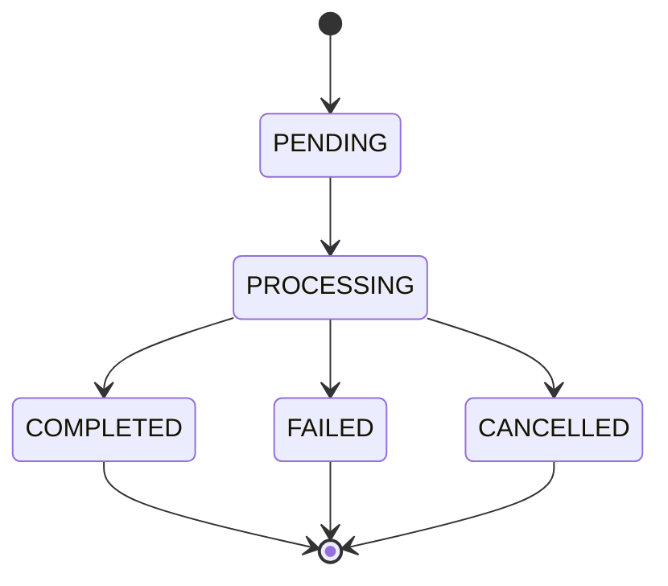

# 母婴订单（篮子/背包）上传 Excel 生成 PPT 逻辑说明

## 1. 当前处理逻辑（现状）

### 1.1 上传入口

- 接口：`POST /baskets/generate`
- 代码入口：`basket.controller.ts` -> `basketService.generateBasketOrders(...)`
- 请求参数：
  - `file`：Excel 文件
  - `orderType`：`basket | backpack | all`
  - `originalFilename`：前端传入原始文件名（可选）
- 当前行为：
  - 校验文件合法性（扩展名、文件名、体积）
  - 校验当前用户是否已配置可用 `SKUConfig`
  - 先创建 DB 记录 `basket_generation_records`（`pending`）
  - 创建 `jobId`（内存队列）
  - 异步启动生成流程并立即返回 `recordId + jobId`

### 1.2 进度查询

- 实时状态接口：`GET /baskets/generate/:jobId/status`
  - 来源：`JobQueueService` 内存状态
- 历史记录接口：`GET /baskets/records`
  - 来源：`basket_generation_records` 数据库记录（支持分页与筛选）
- 单条记录接口：`GET /baskets/records/:id`

### 1.3 后台处理主流程

```mermaid
flowchart TD
    A[上传Excel] --> B[创建 basket_generation_records: pending]
    B --> C[创建 jobId]
    C --> D[异步任务开始: processing]
    D --> E[读取并解析Excel]
    E --> F[按 SKUConfig 识别订单类型]
    F --> G[LLM解析 variations]
    G --> H[应用颜色映射/字体配置]
    H --> I[生成导出Excel 含二维码]
    I --> J[组装PPT数据]
    J --> K[调用Python生成PPT]
    K --> L[打包 ZIP (PPT + Excel)]
    L --> M[写 outputFilePath, status=completed]
```


---

## 2. 涉及到的核心数据表与状态

### 2.1 当前涉及表

1. `basket_generation_records`（核心任务表）

- 记录每次上传任务生命周期
- 关键字段：
  - `originalFilename`
  - `status` / `progress`
  - `jobId`
  - `outputFilePath`
  - `ordersProcessed` / `totalOrders`
  - `orderIds` / `skus`
  - `errorMessage`
  - `userId`

1. `sku_configs`

- 母婴 SKU 规则与样式配置来源
- 关键字段：
  - `sku`, `type`（basket/backpack/combo）
  - `replaceValue`, `fontSize`, `font`
  - `yarnColorMap`
  - `comboItems`
  - `externalOrderReminder*`

1. `users`

- 权限隔离（普通用户仅可看自己的记录）
- 店铺名会被带入导出 Excel / PPT 数据中

> 当前母婴链路不会把明细订单写入 `orders / etsy_orders`。

### 2.2 当前状态存储方式

#### A. 任务持久化状态（DB）

- 存在 `basket_generation_records.status`
- 状态值：
  - `pending`
  - `processing`
  - `completed`
  - `failed`
  - `cancelled`

#### B. 任务实时状态（内存）

- 存在 `JobQueueService` 的 `Map`
- 用于前端轮询进度与即时 message
- 会定时清理（完成后 3 小时，失败/取消后 1 小时）

---

## 3. Excel -> PPT 的关键业务规则

### 3.1 订单识别

- 逐行读取 Excel 后，按 `SKUConfig` 做 SKU 模糊匹配（`sku.includes(config.sku)`）
- 未匹配到配置的行会被跳过
- `orderType=all` 时保留所有已匹配类型；否则按指定类型过滤

### 3.2 变量解析（Variations）

- 通过 LLM 解析 `Variations`，抽取：
  - `color`
  - `value`（定制内容）
  - `icon`（背包/组合场景）
- 解析失败时会降级为保留原文

### 3.3 配置应用

- 字段替换：`sku` 的匹配片段可替换为 `replaceValue`
- 颜色映射：`yarnColorMap` 对颜色进行归一化映射
- 样式配置：携带 `fontSize` / `font`
- 组合 SKU：按 `comboItems` 展开为多行/多页

### 3.4 输出产物

- 先生成“导出 Excel”：
  - 包含订单号、序号、收货信息、自定义信息、二维码等字段
- 再调用 Python 生成 PPT
- 最终打包 ZIP（PPT + 导出 Excel）
- `outputFilePath` 存 Web 可访问路径：`/uploads/baskets/{zipFileName}`

---

## 4. 为什么能看到历史上传记录

母婴这条链路可以查看历史，核心原因是：

1. 任务记录从一开始就写入 `basket_generation_records`
2. 处理过程中持续更新 DB 状态和进度
3. 提供 `GET /baskets/records` 分页接口查询历史
4. 结果文件路径 `outputFilePath` 持久化在 DB，可重复下载

---

## 5. 当前风险点与建议优化

## 5.1 风险点

1. 实时状态依赖内存队列，服务重启会丢失“即时进度”
2. 明细订单级数据未入库，追溯单行解析结果能力有限
3. LLM 解析结果质量受提示词与输入质量影响

## 5.2 优化建议（可选）

1. 增加任务事件表（`basket_generation_events`）记录关键阶段日志
2. 增加“解析明细表”保存每行识别结果与失败原因
3. 给 LLM 解析增加人工纠错回写与词典机制（颜色/icon）
4. 将任务状态查询改为“内存优先 + DB兜底”统一模式（与印章链路对齐）

---

## 6. 状态机（母婴任务）




说明：

- 该状态机对应 `basket_generation_records.status`
- 与印章 `orders.status` 的业务状态机不同，母婴这里是“任务执行状态机”

---

## 7. 对照结论（与印章链路的差异）

1. 印章/摇铃：订单明细在 `orders + etsy_orders`，但上传任务历史目前未持久化
2. 母婴：上传任务历史已持久化在 `basket_generation_records`，但订单明细不走 `orders/etsy_orders`
3. 因此母婴现在“可回看历史上传并重复下载”，而印章目前“只能短期看内存任务状态”

