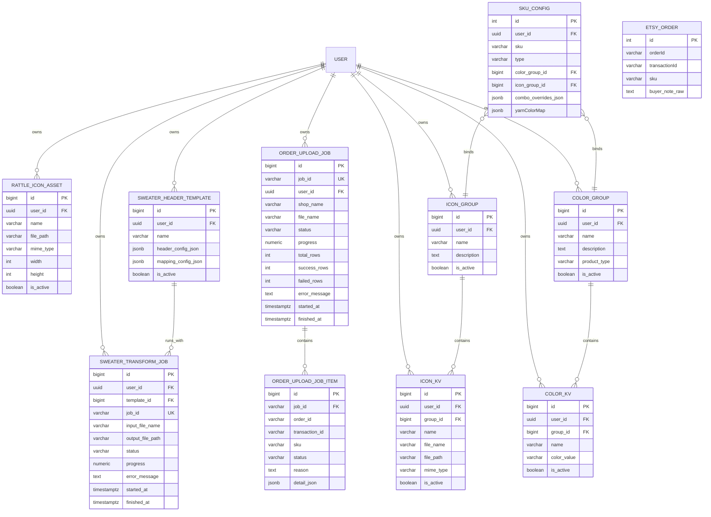

# 基于用户反馈的整体改造计划（后端 + 前后端）

> 模块化拆分文档入口：`./feedback-modules/00-index.md`

## 0. 目标与范围

本计划基于 `[user-feedback-issues.md](./user-feedback-issues.md)` 制定，覆盖以下业务线：

- 摇铃模块：icon 资产库、模板复制“另存为”
- 母婴模块：颜色/icon 字典+组、套组 SKU 二级配置
- 印章模块：上传任务历史、buyer note 解析
- 毛衣模块（母婴子品类）：excel to excel + 自定义表头模板

---

## 1. 新增数据表清单

### 1.1 `rattle_icon_assets`（摇铃图标资产库）

用途：
- 摇铃模板编辑时上传/选择 icon
- 不做 alias，直接由用户上传后选择

核心字段：
- `id` (bigserial, PK)
- `user_id` (uuid, nullable)
- `name` (varchar)
- `file_path` (varchar)
- `mime_type` (varchar)
- `width` / `height` (int, nullable)
- `is_active` (boolean, default true)
- `created_at` / `updated_at`

### 1.2 `color_groups`（颜色组）

用途：
- 母婴 SKU 绑定颜色组

核心字段：
- `id` (bigserial, PK)
- `user_id` (uuid, FK)
- `name` (varchar)
- `description` (text, nullable)
- `product_type` (varchar, nullable) // basket/backpack/sweater
- `is_active` (boolean, default true)
- `created_at` / `updated_at`

### 1.3 `color_kv`（颜色字典项）

用途：
- 颜色键值词典，按组反向归属（ORM 友好）

核心字段：
- `id` (bigserial, PK)
- `user_id` (uuid, nullable)
- `group_id` (bigint, FK -> `color_groups.id`)
- `name` (varchar)          // key
- `color_value` (varchar)   // value
- `is_active` (boolean, default true)
- `created_at` / `updated_at`

### 1.4 `icon_groups`（母婴 icon 组）

用途：
- 母婴 SKU 绑定 icon 组

核心字段：
- `id` (bigserial, PK)
- `user_id` (uuid, FK)
- `name` (varchar)
- `description` (text, nullable)
- `is_active` (boolean, default true)
- `created_at` / `updated_at`

### 1.5 `icon_kv`（母婴 icon 字典项）

用途：
- icon 词典，按组反向归属（ORM 友好）

核心字段：
- `id` (bigserial, PK)
- `user_id` (uuid, nullable)
- `group_id` (bigint, FK -> `icon_groups.id`)
- `name` (varchar)
- `file_name` (varchar)
- `file_path` (varchar)
- `mime_type` (varchar)
- `is_active` (boolean, default true)
- `created_at` / `updated_at`

### 1.6 `order_upload_jobs`（印章/摇铃上传任务历史）

用途：
- 持久化上传任务状态，解决历史不可查

核心字段：
- `id` (bigserial, PK)
- `job_id` (varchar, unique)
- `user_id` (uuid, FK)
- `shop_name` (varchar, nullable)
- `file_name` (varchar)
- `status` (varchar) // queued/processing/completed/failed/cancelled
- `progress` (numeric(5,2), default 0)
- `total_rows` / `success_rows` / `failed_rows` (int, default 0)
- `error_message` (text, nullable)
- `started_at` / `finished_at` (timestamptz, nullable)
- `created_at` / `updated_at`

### 1.7 `order_upload_job_items`（上传任务订单明细）

用途：
- 1 个 job 对应多个订单，记录每个订单处理结果与失败原因

核心字段：
- `id` (bigserial, PK)
- `job_id` (varchar, FK -> `order_upload_jobs.job_id`)
- `order_id` (varchar, nullable)
- `transaction_id` (varchar, nullable)
- `sku` (varchar, nullable)
- `status` (varchar) // success/skipped/failed
- `reason` (text, nullable)
- `detail_json` (jsonb, nullable)
- `created_at` / `updated_at`

### 1.8 `sweater_header_templates`（毛衣自定义表头模板）

用途：
- excel to excel 时选择模板输出

核心字段：
- `id` (bigserial, PK)
- `user_id` (uuid, FK)
- `name` (varchar)
- `header_config_json` (jsonb)
- `mapping_config_json` (jsonb, nullable) // 先保留，规则后续确定
- `is_active` (boolean, default true)
- `created_at` / `updated_at`

### 1.9 `sweater_transform_jobs`（毛衣转换记录）

用途：
- 记录每次 excel to excel 转换任务

核心字段：
- `id` (bigserial, PK)
- `user_id` (uuid, FK)
- `template_id` (bigint, FK -> `sweater_header_templates.id`)
- `job_id` (varchar, unique)
- `input_file_name` (varchar)
- `output_file_path` (varchar, nullable)
- `status` (varchar) // pending/processing/completed/failed/cancelled
- `progress` (numeric(5,2), default 0)
- `error_message` (text, nullable)
- `started_at` / `finished_at` (timestamptz, nullable)
- `created_at` / `updated_at`

---

## 2. 已有表改造清单

### 2.1 `sku_configs` 需要修改

新增字段：
- `color_group_id` (bigint, nullable, FK -> `color_groups.id`)
- `icon_group_id` (bigint, nullable, FK -> `icon_groups.id`)
- `combo_overrides_json` (jsonb, nullable)

`combo_overrides_json` 约束：
- color/icon 必须绑定 `group_id`（不存纯文本）
- 页面按 `group.name` 搜索，选中后回填 `group_id`

建议结构示例：
```json
{
  "SKU-A": {
    "fontSize": 18,
    "colorGroupId": 12,
    "iconGroupId": 5
  }
}
```

兼容字段：
- `yarnColorMap` 暂时保留（只读兜底）

读取优先级（母婴生成链路）：
- `combo_overrides_json[childSku]` > `sku_configs.color_group_id/icon_group_id` > `yarnColorMap`（兼容期）

写入策略：
- 新逻辑只写 `color_group_id` / `icon_group_id` / `combo_overrides_json`
- 旧 `yarnColorMap` 不再更新

### 2.2 `etsy_orders` 需要修改

- 新增 `buyer_note_raw`（上传导入时保存买家备注原文）

---

## 3. 每张新表额外处理（索引/初始化/权限）

### 3.1 `rattle_icon_assets`
- 索引：`idx_rattle_icon_assets_user_active(user_id, is_active)`, `idx_rattle_icon_assets_name(name)`
- 初始化：可导入一批常用摇铃 icon
- 权限：普通用户仅管理自己资产；管理员可管理系统资产

### 3.2 `color_groups` / `color_kv`
- 索引：
  - `idx_color_groups_user_active(user_id, is_active)`
  - `idx_color_groups_name(name)`
  - `idx_color_kv_group_id(group_id)`
  - `idx_color_kv_name(name)`
- 初始化：从 `yarnColorMap` 迁移为分组 + 字典项
- 权限：严格 user_id 隔离

### 3.3 `icon_groups` / `icon_kv`
- 索引：
  - `idx_icon_groups_user_active(user_id, is_active)`
  - `idx_icon_groups_name(name)`
  - `idx_icon_kv_group_id(group_id)`
  - `idx_icon_kv_name(name)`
- 初始化：导入母婴常用 icon 字典
- 权限：严格 user_id 隔离

### 3.4 `order_upload_jobs`
- 索引：`unique(job_id)`, `idx_order_upload_jobs_user_created(user_id, created_at desc)`, `idx_order_upload_jobs_status(status)`
- 初始化：无需回填历史，按新机制记录
- 权限：普通用户仅查自己，管理员可查全量

### 3.5 `order_upload_job_items`
- 索引：`idx_order_upload_job_items_job_id(job_id)`, `idx_order_upload_job_items_status(status)`, `idx_order_upload_job_items_order_id(order_id)`
- 初始化：无需回填；新任务自动写明细
- 权限：继承 job 所属权限（先校验 `job_id`）

### 3.6 `sweater_header_templates`
- 索引：`idx_sweater_header_templates_user_active(user_id, is_active)`, `unique(user_id, name)`
- 初始化：可预置 1~2 个系统模板
- 权限：用户仅管理自己的模板

### 3.7 `sweater_transform_jobs`
- 索引：`unique(job_id)`, `idx_sweater_transform_jobs_user_created(user_id, created_at desc)`, `idx_sweater_transform_jobs_status(status)`
- 初始化：无需历史回填，按新任务链路记录
- 权限：普通用户仅可查自己任务，管理员可查全量

---

## 4. 代码实现按模块拆分

### 4.1 P0：基础设施

#### 模块 A：摇铃 icon 库
后端：
- 新建 `rattle-icon-library` 模块
- API：`GET /rattle-icons`, `POST /rattle-icons/upload`, `DELETE /rattle-icons/:id`

前端：
- 摇铃模板编辑器接入“从库选择 + 上传”

#### 模块 B：上传任务历史
后端：
- `orders` 模块接入 `order_upload_jobs`
- 新增 `order_upload_job_items` 写入（按订单粒度）
- `GET /orders/upload/:jobId/status` 改为“内存优先 + DB 兜底”
- 新增 `GET /orders/upload-jobs`
- 新增 `GET /orders/upload-jobs/:jobId/items`

前端：
- 印章/摇铃页面增加“上传任务历史”
- 失败明细弹窗查看具体订单问题

### 4.2 P1：母婴字典+组

#### 模块 C：颜色字典+组
后端：
- 新增 `color-kv`、`color-groups` 接口
- `color_kv` 通过 `group_id` 归组
- `sku_configs` 绑定 `color_group_id`

前端：
- 母婴颜色管理页：维护字典项、颜色组、SKU 绑定

#### 模块 D：icon 字典+组
后端：
- 新增 `icon-kv`、`icon-groups` 接口
- `icon_kv` 通过 `group_id` 归组
- `sku_configs` 绑定 `icon_group_id`
- Excel 解析提取 icon 后，在绑定组内匹配 `icon_kv.name`
- 命中后用 `icon_kv.file_path` 注入 PPT 生成参数

前端：
- 母婴 icon 管理页：维护字典项、icon 组、SKU 绑定

#### 模块 E：套组 SKU JSON 配置
后端：
- `sku_configs` 增加 `combo_overrides_json`
- 生成链路读取子 SKU 覆盖配置（group_id）

前端：
- 套组编辑页按 group name 搜索，写入对应 `group_id`

### 4.3 P2：印章备注解析 + 毛衣 Excel-to-Excel

#### 模块 F：印章备注原文
- 导入时解析并写 `buyer_note_raw`
- 订单详情展示 `buyer_note_raw`

#### 模块 G：毛衣表头模板
- 新增 `sweater_header_templates` CRUD
- excel to excel 时选择模板输出
- `mapping_config_json` 字段先保留，暂不实现规则引擎
- 新增 `sweater_transform_jobs` 任务记录（提交、查询状态、查看结果文件）

---

## 5. 汇总改动与影响范围

### 5.1 数据库影响
- 新增 9 张表：
  - `rattle_icon_assets`
  - `color_groups`
  - `color_kv`
  - `icon_groups`
  - `icon_kv`
  - `order_upload_jobs`
  - `order_upload_job_items`
  - `sweater_header_templates`
  - `sweater_transform_jobs`
- 旧表增量：`sku_configs`, `etsy_orders`

### 5.2 后端影响
- `orders`：上传任务历史、任务子项明细、buyer note
- `basket`：颜色/icon 字典+组、combo JSON 解析
- `stamps/rattle`：摇铃 icon 库接入

### 5.3 前端影响
- 摇铃模板页：icon 库选择
- 母婴配置页：颜色/icon 字典+组管理
- 套组编辑页：group 选择 + JSON 覆盖
- 订单页：上传任务历史 + 失败订单明细
- 毛衣页：模板化 excel to excel

---

## 6. Mermaid 图

### 6.1 数据模型图（字段版）



说明：图中按要求隐藏了 `created_at`、`updated_at` 字段，其他关键字段均展示。

### 6.2 实施路径


