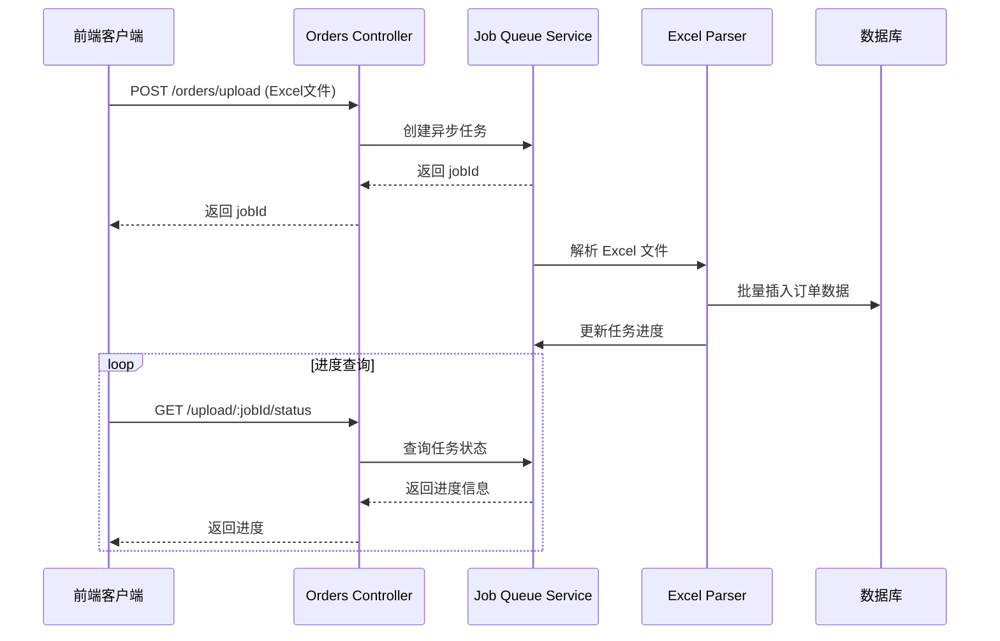
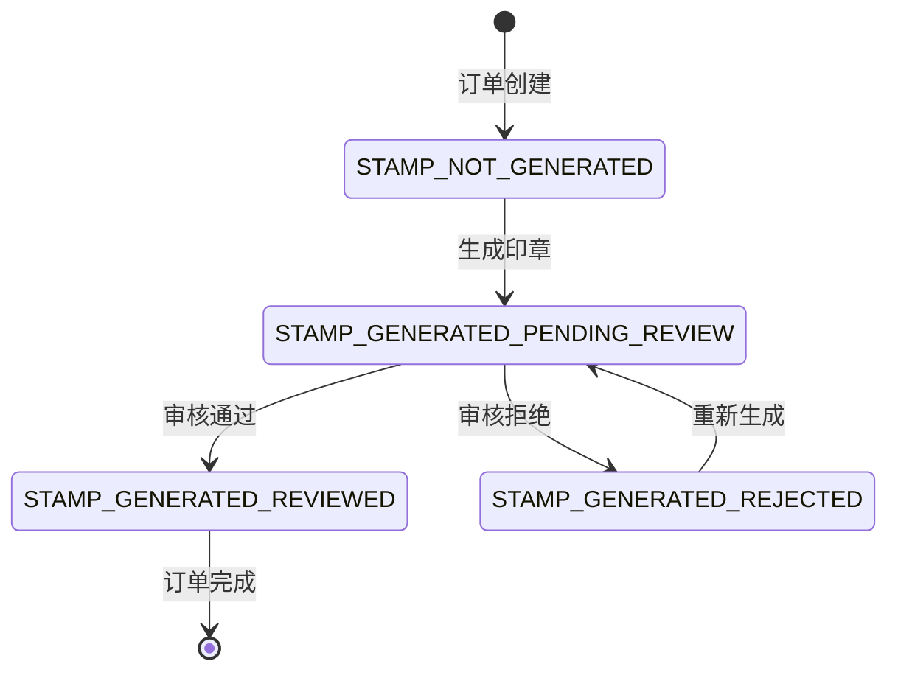
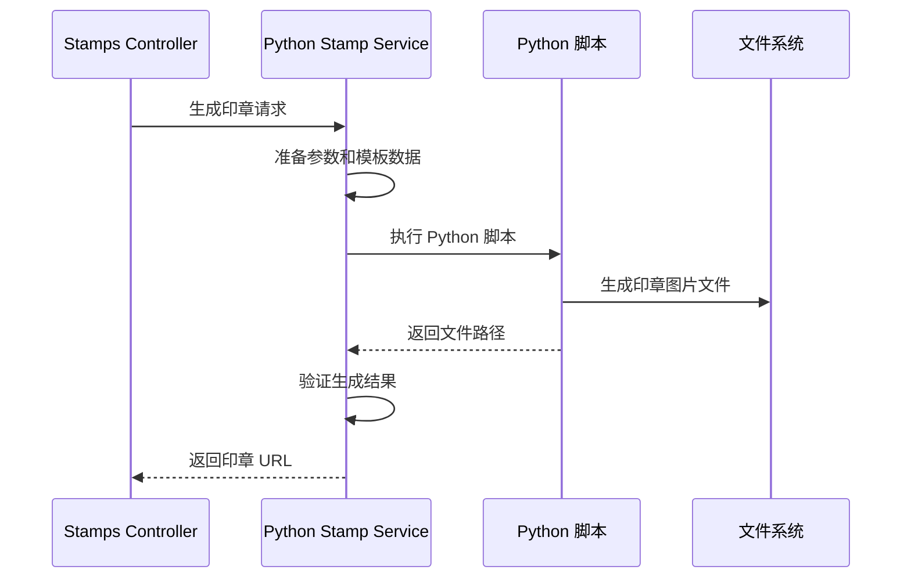
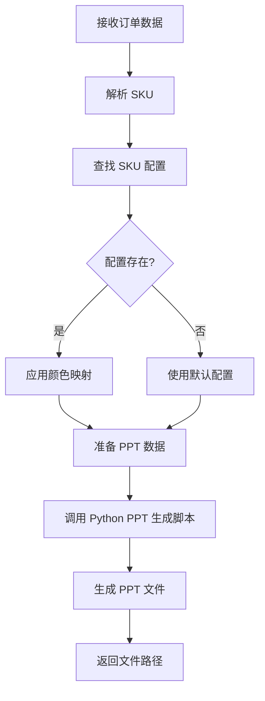

# 后端产品规格说明

## 系统概述

Etsy Helper Server 是一个基于 NestJS 的企业级订单管理后端服务，专门处理 Etsy 订单导入、印章生成、母婴产品配置等复杂业务逻辑。系统采用模块化架构，支持多租户、异步任务处理和 Python 脚本集成。

## API 架构设计

### RESTful API 结构
```
/api/v1/
├── auth/                     # 认证相关
│   ├── POST /login          # 用户登录
│   └── POST /register       # 用户注册 (管理员)
├── users/                   # 用户管理
│   ├── GET /users           # 用户列表
│   ├── POST /users          # 创建用户
│   ├── PUT /users/:id       # 更新用户
│   └── DELETE /users/:id    # 删除用户
├── orders/                  # 订单管理
│   ├── POST /upload         # 异步 Excel 上传
│   ├── GET /upload/:jobId/status  # 任务状态查询
│   ├── GET /orders          # 分页订单列表
│   ├── GET /orders/:id      # 订单详情
│   ├── PUT /orders/:id/stamp # 更新订单印章
│   └── POST /export-stamps  # 批量导出印章
├── stamps/                  # 印章系统
│   ├── GET /templates       # 模板列表
│   ├── POST /templates      # 创建模板
│   ├── PUT /templates/:id   # 更新模板
│   ├── POST /upload-background # 背景图上传
│   ├── POST /upload-icon    # 图标上传
│   ├── POST /preview        # 模板预览
│   └── POST /generate       # 印章生成
├── basket/                  # 母婴产品
│   ├── GET /sku-configs     # SKU 配置列表
│   ├── POST /sku-configs    # 创建 SKU 配置
│   ├── PUT /sku-configs/:id # 更新 SKU 配置
│   └── POST /generate       # 生成产品 PPT
└── fonts/                   # 字体管理
    ├── GET /fonts           # 字体列表
    ├── POST /upload         # 字体上传
    └── DELETE /fonts/:id    # 删除字体
```

### API 响应格式标准

#### 成功响应
```typescript
interface SuccessResponse<T> {
  success: true
  data: T
  message?: string
  timestamp: string
}
```

#### 分页响应
```typescript
interface PaginatedResponse<T> {
  success: true
  data: T[]
  pagination: {
    page: number
    limit: number
    total: number
    totalPages: number
  }
  timestamp: string
}
```

#### 错误响应
```typescript
interface ErrorResponse {
  success: false
  error: {
    code: string
    message: string
    details?: any
  }
  timestamp: string
}
```

## 数据模型详细设计

### 用户系统 (Users)

#### User Entity
```typescript
@Entity('users')
export class User {
  @PrimaryGeneratedColumn('uuid')
  id: string

  @Column({ unique: true })
  username: string

  @Column()
  password: string  // bcrypt 加密

  @Column({ default: false })
  isAdmin: boolean

  @Column({ nullable: true })
  shopName: string

  @OneToMany(() => Order, order => order.user)
  orders: Order[]

  @CreateDateColumn()
  createdAt: Date

  @UpdateDateColumn()
  updatedAt: Date
}
```

### 订单系统 (Orders)

#### Order Entity
```typescript
@Entity('orders')
export class Order {
  @PrimaryGeneratedColumn('uuid')
  id: string

  @Column({
    type: 'enum',
    enum: ['ETSY', 'MANUAL', 'OTHER'],
    default: 'ETSY'
  })
  type: OrderType

  @Column({
    type: 'enum',
    enum: [
      'STAMP_NOT_GENERATED',
      'STAMP_GENERATED_PENDING_REVIEW',
      'STAMP_GENERATED_REVIEWED',
      'STAMP_GENERATED_REJECTED'
    ]
  })
  status: OrderStatus

  @ManyToOne(() => User, user => user.orders)
  user: User

  @Column()
  userId: string

  @OneToOne(() => EtsyOrder, etsyOrder => etsyOrder.order)
  etsyOrder: EtsyOrder

  @ManyToOne(() => StampTemplate)
  stampTemplate: StampTemplate

  @Column({ nullable: true })
  stampTemplateId: string

  @CreateDateColumn()
  createdAt: Date

  @UpdateDateColumn()
  updatedAt: Date
}
```

#### EtsyOrder Entity (详细订单信息)
```typescript
@Entity('etsy_orders')
export class EtsyOrder {
  @PrimaryGeneratedColumn('uuid')
  id: string

  // 买家信息
  @Column()
  buyerUserId: string

  @Column()
  buyerEmail: string

  @Column()
  buyerName: string

  // 订单基本信息
  @Column()
  orderDate: string

  @Column()
  orderValue: string

  @Column()
  currency: string

  // 产品信息
  @Column()
  itemName: string

  @Column()
  itemId: string

  @Column()
  sku: string

  @Column()
  variations: string  // JSON 字符串

  @Column()
  quantity: number

  @Column()
  itemPrice: string

  // 配送信息
  @Column()
  shippingName: string

  @Column()
  shippingAddress1: string

  @Column()
  shippingAddress2: string

  @Column()
  shippingCity: string

  @Column()
  shippingState: string

  @Column()
  shippingZip: string

  @Column()
  shippingCountry: string

  // 印章相关
  @Column('text', { array: true, default: [] })
  stampImageUrls: string[]

  @Column('text', { array: true, default: [] })
  generationRecordIds: string[]

  // 特殊标识
  @Column({ default: false })
  isRemoteArea: boolean

  @OneToOne(() => Order, order => order.etsyOrder)
  @JoinColumn()
  order: Order
}
```

### 印章系统 (Stamps)

#### StampTemplate Entity
```typescript
@Entity('stamp_templates')
export class StampTemplate {
  @PrimaryGeneratedColumn('uuid')
  id: string

  @Column()
  name: string

  @Column()
  type: string  // rubber, steel, photosensitive, etc.

  @Column('text', { array: true })
  skus: string[]  // 支持多个 SKU

  @Column('float')
  width: number

  @Column('float')
  height: number

  // 文本元素配置
  @Column('jsonb')
  textElements: TextElement[]

  // 图标配置
  @Column('jsonb', { nullable: true })
  iconConfig: IconConfig

  @Column({ nullable: true })
  backgroundImage: string

  @Column({ default: true })
  isActive: boolean

  @CreateDateColumn()
  createdAt: Date

  @UpdateDateColumn()
  updatedAt: Date
}

interface TextElement {
  id: string
  text: string
  x: number
  y: number
  fontSize: number
  fontFamily: string
  color: string
  rotation?: number
  isCircular?: boolean
  circularRadius?: number
}

interface IconConfig {
  iconPath: string
  x: number
  y: number
  width: number
  height: number
}
```

### 母婴产品系统 (Basket)

#### SkuConfig Entity
```typescript
@Entity('sku_configs')
export class SkuConfig {
  @PrimaryGeneratedColumn('uuid')
  id: string

  @Column({ unique: true })
  sku: string

  // 毛线颜色映射
  @Column('jsonb')
  yarnColorMapping: Record<string, string>

  // 字体配置
  @Column('jsonb')
  fontConfig: FontConfig

  @Column({ nullable: true })
  externalOrderReminder: string

  @Column({ default: true })
  isActive: boolean

  @CreateDateColumn()
  createdAt: Date

  @UpdateDateColumn()
  updatedAt: Date
}

interface FontConfig {
  fontFamily: string
  fontSize: number
  color: string
  bold?: boolean
  italic?: boolean
}
```

## 业务流程详细设计

### 订单处理流程

#### 1. Excel 文件上传流程


#### 2. 订单状态管理


### 印章生成流程

#### Python 脚本集成


### 母婴产品处理流程

#### SKU 配置和 PPT 生成


## 安全设计

### 认证和授权

#### JWT 令牌结构
```typescript
interface JWTPayload {
  sub: string      // 用户 ID
  username: string
  isAdmin: boolean
  shopName?: string
  iat: number      // 签发时间
  exp: number      // 过期时间
}
```

#### 权限控制
```typescript
// 公开路由装饰器
@Public()
@Post('login')
async login() { ... }

// 管理员权限装饰器
@AdminOnly()
@Get('users')
async getUsers() { ... }

// 当前用户注入
@Get('profile')
async getProfile(@CurrentUser() user: User) { ... }
```

### 文件上传安全

#### 文件验证规则
```typescript
const fileValidation = {
  // 允许的文件类型
  allowedMimeTypes: [
    'application/vnd.openxmlformats-officedocument.spreadsheetml.sheet', // .xlsx
    'image/png',
    'image/jpeg',
    'font/ttf',
    'font/otf'
  ],

  // 文件大小限制
  maxFileSize: {
    excel: 10 * 1024 * 1024,    // 10MB
    image: 5 * 1024 * 1024,     // 5MB
    font: 2 * 1024 * 1024       // 2MB
  },

  // 文件名安全检查
  fileNamePattern: /^[a-zA-Z0-9._-]+$/
}
```

## 性能优化设计

### 数据库优化

#### 索引策略
```sql
-- 用户查询优化
CREATE INDEX idx_users_username ON users(username);
CREATE INDEX idx_users_shop_name ON users(shop_name);

-- 订单查询优化
CREATE INDEX idx_orders_user_id ON orders(user_id);
CREATE INDEX idx_orders_status ON orders(status);
CREATE INDEX idx_orders_created_at ON orders(created_at);

-- Etsy 订单查询优化
CREATE INDEX idx_etsy_orders_buyer_email ON etsy_orders(buyer_email);
CREATE INDEX idx_etsy_orders_sku ON etsy_orders(sku);
CREATE INDEX idx_etsy_orders_order_date ON etsy_orders(order_date);

-- 印章模板查询优化
CREATE INDEX idx_stamp_templates_type ON stamp_templates(type);
CREATE INDEX idx_stamp_templates_skus ON stamp_templates USING GIN(skus);
```

#### 查询优化
```typescript
// 分页查询优化
async findOrdersWithPagination(
  userId: string,
  page: number,
  limit: number,
  filters?: OrderFilters
) {
  const queryBuilder = this.orderRepository
    .createQueryBuilder('order')
    .leftJoinAndSelect('order.etsyOrder', 'etsyOrder')
    .leftJoinAndSelect('order.stampTemplate', 'template')
    .where('order.userId = :userId', { userId })
    .orderBy('order.createdAt', 'DESC')
    .skip((page - 1) * limit)
    .take(limit);

  if (filters?.status) {
    queryBuilder.andWhere('order.status = :status', { status: filters.status });
  }

  return queryBuilder.getManyAndCount();
}
```

### 缓存策略

#### Redis 缓存设计
```typescript
// 缓存键命名规范
const CACHE_KEYS = {
  USER_PROFILE: (userId: string) => `user:profile:${userId}`,
  STAMP_TEMPLATE: (templateId: string) => `stamp:template:${templateId}`,
  SKU_CONFIG: (sku: string) => `sku:config:${sku}`,
  ORDER_COUNT: (userId: string) => `order:count:${userId}`
};

// 缓存 TTL 配置
const CACHE_TTL = {
  USER_PROFILE: 3600,      // 1小时
  STAMP_TEMPLATE: 7200,    // 2小时
  SKU_CONFIG: 1800,        // 30分钟
  ORDER_COUNT: 300         // 5分钟
};
```

## 监控和日志

### 日志记录策略

#### 日志级别和格式
```typescript
// 日志配置
const loggerConfig = {
  level: process.env.LOG_LEVEL || 'info',
  format: 'json',
  timestamp: true,

  // 日志字段标准
  fields: {
    service: 'etsy-helper-server',
    version: process.env.APP_VERSION,
    environment: process.env.NODE_ENV,
    userId: 'extracted from JWT',
    requestId: 'generated UUID',
    action: 'controller.method',
    duration: 'execution time in ms'
  }
};

// 关键操作日志
@Injectable()
export class AuditLogger {
  logOrderUpload(userId: string, fileName: string, recordCount: number) {
    this.logger.info('Order upload completed', {
      userId,
      fileName,
      recordCount,
      action: 'orders.upload'
    });
  }

  logStampGeneration(userId: string, orderId: string, templateId: string) {
    this.logger.info('Stamp generated', {
      userId,
      orderId,
      templateId,
      action: 'stamps.generate'
    });
  }
}
```

### 性能监控

#### 关键指标
```typescript
// 性能指标收集
const performanceMetrics = {
  // API 响应时间
  apiResponseTime: {
    'POST /orders/upload': 'p95 < 5000ms',
    'GET /orders': 'p95 < 500ms',
    'POST /stamps/generate': 'p95 < 3000ms'
  },

  // 数据库查询时间
  dbQueryTime: {
    'orders.findWithPagination': 'p95 < 200ms',
    'stamps.findByTemplate': 'p95 < 100ms'
  },

  // Python 脚本执行时间
  pythonScriptTime: {
    'stamp_generation': 'p95 < 2000ms',
    'ppt_generation': 'p95 < 5000ms'
  },

  // 系统资源使用
  systemMetrics: {
    cpuUsage: 'avg < 70%',
    memoryUsage: 'avg < 80%',
    diskUsage: 'avg < 85%'
  }
};
```

## 部署和运维

### 环境配置

#### 生产环境要求
```yaml
# docker-compose.yml
version: '3.8'
services:
  app:
    image: etsy-helper-server:latest
    environment:
      NODE_ENV: production
      DATABASE_URL: ${DATABASE_URL}
      JWT_SECRET: ${JWT_SECRET}
      REDIS_URL: ${REDIS_URL}
    volumes:
      - ./uploads:/app/uploads
      - ./logs:/app/logs

  postgres:
    image: postgres:14
    environment:
      POSTGRES_DB: etsy_helper
      POSTGRES_USER: ${DB_USER}
      POSTGRES_PASSWORD: ${DB_PASSWORD}
    volumes:
      - postgres_data:/var/lib/postgresql/data

  redis:
    image: redis:7-alpine
    volumes:
      - redis_data:/data
```

### 备份策略

#### 数据备份计划
```bash
#!/bin/bash
# 数据库备份脚本

BACKUP_DIR="/backups"
DATE=$(date +%Y%m%d_%H%M%S)
DB_NAME="etsy_helper"

# 数据库备份
pg_dump -h localhost -U postgres $DB_NAME > "$BACKUP_DIR/db_backup_$DATE.sql"

# 文件备份
tar -czf "$BACKUP_DIR/uploads_backup_$DATE.tar.gz" ./uploads

# 清理旧备份 (保留30天)
find $BACKUP_DIR -name "*.sql" -mtime +30 -delete
find $BACKUP_DIR -name "*.tar.gz" -mtime +30 -delete
```

---

*文档版本: 1.0*
*最后更新: 2026-03-01*
*维护者: 后端开发团队*