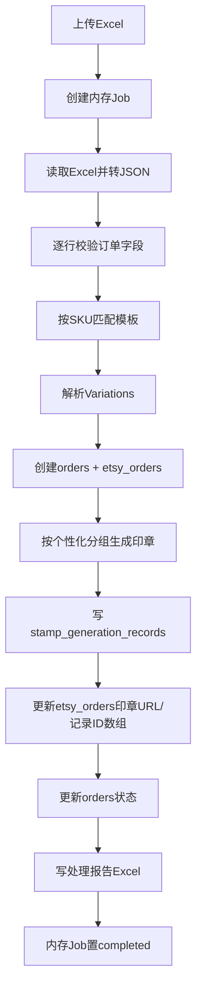
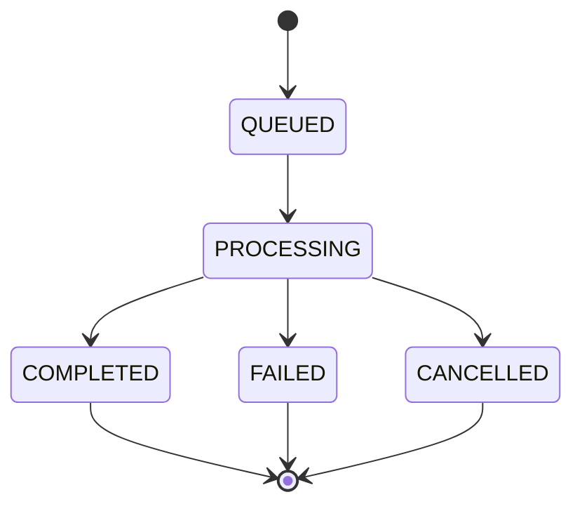

# 印章订单上传处理逻辑与改造方案

## 1. 当前处理逻辑（现状）

### 1.1 上传入口

- 接口：`POST /orders/upload`
- 代码入口：`orders.controller.ts` -> `excelService.processExcelFileAsync(file, user)`
- 当前行为：
  - 校验 Excel 扩展名与文件名安全性
  - 创建 `jobId`
  - 异步启动解析与生成流程
  - 立即返回 `{ jobId, status: "processing" }`

### 1.2 进度查询

- 接口：`GET /orders/upload/:jobId/status`
- 数据来源：`JobQueueService` 内存 `Map<string, JobProgress>`
- 返回字段：
  - `status`：`pending | processing | completed | failed | cancelled`
  - `progress`：0~100
  - `message`
  - `result`（完成后统计信息）
  - `error`（失败时）

### 1.3 后台处理主流程

---

## 2. 涉及到的核心数据表与状态

## 2.1 当前涉及表

1. `orders`
- 作用：订单主表，承载状态机与用户归属
- 关键字段：`id`, `userId`, `status`, `templateId`, `platformOrderId`

2. `etsy_orders`
- 作用：Etsy 原始订单详情
- 关键字段：`orderId`, `transactionId`, `sku`, `variations`, `originalVariations`
- 印章结果字段：`stampImageUrls`(jsonb), `stampGenerationRecordIds`(jsonb)

3. `stamp_generation_records`
- 作用：每次印章生成的审计记录
- 关键字段：`orderId`, `templateId`, `textElements`, `stampImageUrl`

4. `stamp_templates`
- 作用：按 SKU 匹配模板，驱动印章生成

5. `users`
- 作用：权限控制；普通用户只能看到自己的任务/订单

> 当前“上传任务状态”**没有数据库表**，仅存在内存队列服务中。

## 2.2 当前状态存储方式

### A. 上传任务状态（Job）
- 存在 `JobQueueService.jobs` 内存 `Map`
- 状态值：`pending | processing | completed | failed | cancelled`
- 清理机制：默认 1 小时后 `jobs.delete(jobId)`
- 问题：服务重启即丢失，且超时后无法查询历史

### B. 订单业务状态（OrderStatus）
- 存在 `orders.status`
- 枚举：
  - `stamp_not_generated`
  - `stamp_generated_pending_review`
  - `stamp_generated_reviewed`
  - `stamp_generated_review_rejected`

---

## 3. 用户反馈“无法查看上传状态”的根因

1. 上传任务状态仅在内存中，未持久化到数据库  
2. 完成任务默认 1 小时后自动清除  
3. 服务重启后 `Map` 清空，历史任务不可恢复  
4. 当前只有“按 jobId 查询单任务”，没有“任务历史列表”接口

---

## 4. 改造方案（新增处理方案）

## 4.1 新增表：`order_upload_jobs`（P0 必做）

用途：持久化上传任务生命周期，支持历史回看、分页筛选、失败排查。

建议字段：
- `id` (bigserial, PK)
- `job_id` (varchar, unique)
- `user_id` (uuid, FK -> users.id)
- `shop_name` (varchar, nullable)
- `file_name` (varchar)
- `status` (`queued | processing | completed | failed | cancelled`)
- `progress` (numeric(5,2), default 0)
- `total_rows` / `success_rows` / `failed_rows` (int)
- `error_message` (text, nullable)
- `report_path` (varchar, nullable)
- `started_at` / `finished_at` (timestamptz, nullable)
- `created_at` / `updated_at`

必备索引：
- `unique(job_id)`
- `idx_order_upload_jobs_user_created(user_id, created_at desc)`
- `idx_order_upload_jobs_status(status)`

权限：
- 普通用户：仅可查自己的 `user_id`
- 管理员：可查全量，可按 `shop_name/user_id/status` 过滤

## 4.1.1 新增表：`order_upload_job_items`（推荐）

用途：
- 一条上传任务会处理多笔订单，单独记录每笔订单处理结果
- 精确定位“哪一单失败/跳过、原因是什么”

建议字段：
- `id` (bigserial, PK)
- `job_id` (varchar, FK -> `order_upload_jobs.job_id`)
- `order_id` (varchar, nullable)
- `transaction_id` (varchar, nullable)
- `sku` (varchar, nullable)
- `status` (`success | skipped | failed`)
- `reason` (text, nullable)
- `detail_json` (jsonb, nullable)  // 可存解析失败、模板匹配失败、生成失败等细节
- `created_at` / `updated_at`

索引建议：
- `idx_order_upload_job_items_job_id(job_id)`
- `idx_order_upload_job_items_status(status)`
- `idx_order_upload_job_items_order_id(order_id)`

## 4.2 状态写入策略（双写）

改造后状态来源分两层：

1. 实时层：`JobQueueService`（保留，用于秒级进度刷新）
2. 持久层：`order_upload_jobs`（用于历史查询与审计）

状态更新规则：
- `createJob` 时：插入 DB 记录 `queued`
- 开始处理：更新 DB 为 `processing`，写 `started_at`
- 处理中：按批次更新 `progress/total_rows`
- 完成：`completed + finished_at + report_path + success_rows/failed_rows`
- 失败：`failed + finished_at + error_message`
- 取消：`cancelled + finished_at`
- 同时按订单维度写入 `order_upload_job_items`（success/skipped/failed + reason）

## 4.3 接口改造

1. 保持兼容：
- 继续保留 `GET /orders/upload/:jobId/status`
- 查询逻辑变为：先读内存实时态；不存在则回退 DB 历史态

2. 新增历史列表：
- `GET /orders/upload-jobs`
- 支持：`page`, `limit`, `status`, `dateFrom`, `dateTo`, `userId(管理员)`

3. 新增详情（可选）：
- `GET /orders/upload-jobs/:jobId`
- 用于失败排查与展示报告下载地址

4. 新增任务子项查询（推荐）：
- `GET /orders/upload-jobs/:jobId/items`
- 用于前端展示失败订单列表与原因

## 4.4 前端改造

1. 印章订单页新增“上传任务历史”区域  
2. 上传成功后将 `jobId` 写入本地任务列表并轮询  
3. 页面初始化调用 `GET /orders/upload-jobs` 拉历史，不再依赖本地缓存  
4. 状态展示统一为：
- `排队中 / 处理中(progress%) / 已完成 / 失败 / 已取消`

---

## 5. 推荐实现步骤

1. DB migration：创建 `order_upload_jobs`  
2. 后端新增 `OrderUploadJob` entity + repository  
3. `ExcelService` 与 `JobQueueService` 交互点增加 DB 同步更新  
4. 新增 `GET /orders/upload-jobs` 接口  
5. 改造 `GET /orders/upload/:jobId/status` 为“内存优先 + DB 兜底”  
6. 前端新增历史列表并接入新接口  
7. 验证用例：
- 上传成功后刷新页面仍可查到
- 服务重启后仍可查历史状态
- 普通用户无法看到其他店铺任务

---

## 6. 与现有状态体系的关系

说明：
- 上图是“上传任务状态机”（`order_upload_jobs.status`）
- 不替代 `orders.status`（订单业务状态机），两者并行：
  - `order_upload_jobs` 管“导入任务执行态”
  - `orders.status` 管“订单处理与审核态”

---

## 7. 本次改造收益

1. 用户可查看历史上传任务，不再依赖短期内存状态  
2. 支持失败原因与处理报告回溯，便于运营排障  
3. 支持按用户/店铺做权限隔离，满足多租户场景  
4. 为后续“上传任务看板、重试、告警”提供数据基础
